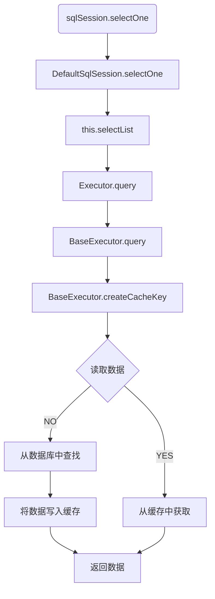

#### 体系结构（上）


#### 主要工作流程

1. 解析配置文件
2. 创建工厂类
3. 创建会话
4. 通过会话操作数据库

#### 架构分层

1. 提供给应用使用：接口层 sqlSession

2. 处理数据库操作：核心层 

   > 配置解析
   >
   > 参数处理
   >
   > SQL执行
   >
   > 结果映射
   >
   > 支持插件

3. 支持工作：基础层

   > 日志
   >
   > 缓存
   >
   > > 基础缓存、装饰器（日志、定时器、LRU、FIFO、weak、soft等）
   >
   > 数据库连接池
   >
   > 事务
   >
   > 反射

#### 一级缓存

一、作用域与维护对象

1. 作用域：会话级别
2. 维护对象： sqlSession --> excutor -->BaseExcutor --> PerpetualCache 

二、存在问题

1. 多个会话 有可能会 导致脏数据，会话1读取，会话2修改，会话1读取不到最新的数据


#### 二级缓存

一、作用域与维护对象

1. 作用域：namspace 命名空间级别（即同一个Mapper 接口）

2. 维护对象：由excutor 的包装类 CachingExcutor 维护

   ```txt
   CachingExcutor --> TransactinalCacheManager
   ---> Map<Cache, TransactionlCache>
   ```

二、和一级缓存的工作顺序

```txt
开启二级缓存后，首先查找二级缓存
```


#### 一级缓存写入删除流程




**每次增删改的时候，会清除一级缓存**

**删除其实调用的就是修改方法**

#### 一级缓存的清除策略

> LRU（最近最少使用）
>
> FIFO（先进先出）
>
> WEAK（虚引用）
>
> SOFT（软引用）