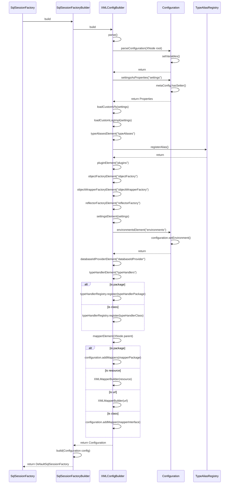
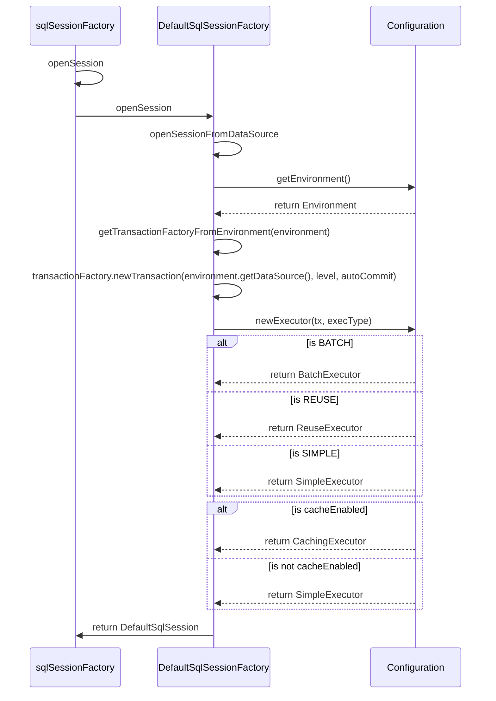
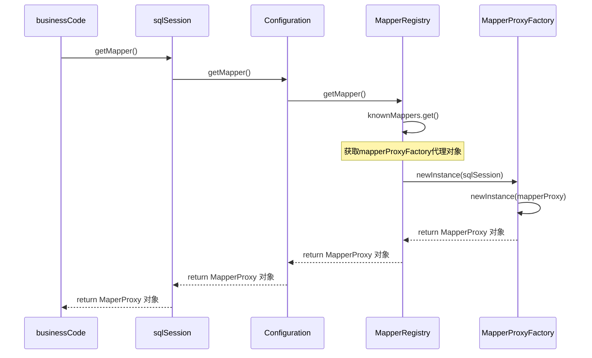
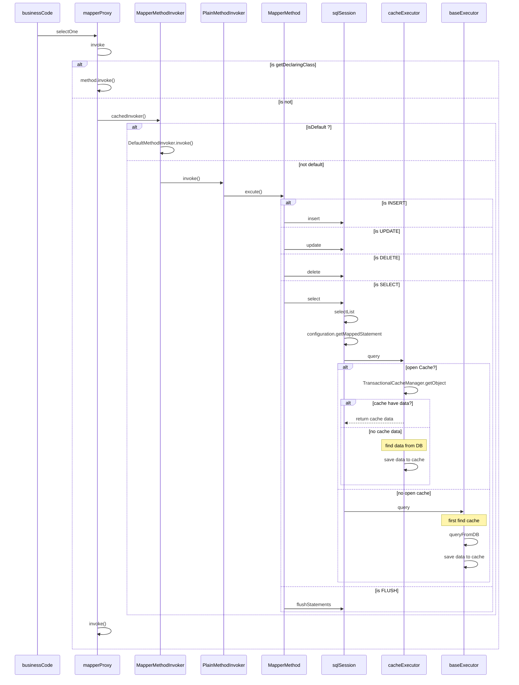

### mybatis 体系结构与工作原理（下）

#### 涉及到的GoF设计模式有哪些？

1. 装饰器
2. 模板方法
3. 代理
4. 拦截器

**SqlSessionFactoryBuilder().build(stream)**

**sqlSessionFactory.openSession**

**sqlSession.getMapper()**

**mapper.selectOne()**

